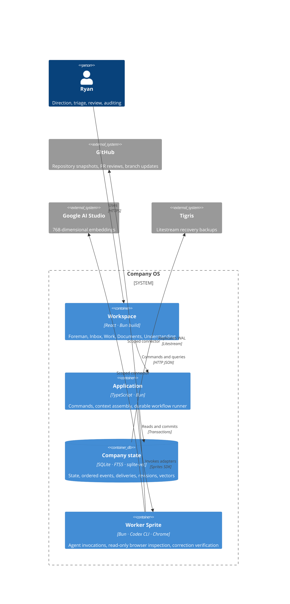

# Architecture

Company OS separates decisions about company state from HTTP, SQLite, agents, GitHub, embeddings and browser execution. The workflow is deterministic code; an agent supplies judgments and proposed outputs, never the next scheduler action.

## Code boundaries

| Layer       | Files                                                               | Responsibilities                                                              |
| ----------- | ------------------------------------------------------------------- | ----------------------------------------------------------------------------- |
| Domain      | `src/domain/model.ts`, `events.ts`, `workflows.ts`, `reviews.ts`    | Valid commands, event payloads, event-to-effect mapping, review quorum rules  |
| Application | `src/application/company.ts`, `context.ts`, `runner.ts`, `ports.ts` | Use cases, context selection, transactions, executing effects through ports   |
| Adapters    | `src/adapters/sqlite.ts`, `agents.ts`, `github.ts`, `browser.ts`    | Persistence and external systems                                              |
| HTTP edge   | `src/server/index.ts`                                               | Authentication, read-only inspection sessions, parsing requests, wiring ports |
| UI          | `src/web`                                                           | Views and human commands                                                      |

The domain imports no network, Sprite, browser or database implementation. The application imports interfaces and domain rules. SQLite reuses the original document/revision/search store; old conversation and proposal tables are imported once. The old worker is retained for legacy recovery tests but is not started in production.

## Persistence and delivery

A command transaction saves state, appends ordered typed events, and stores each event's resulting deliveries atomically. Event envelopes have a sequence, UUID, schema version, actor, correlation ID, causation ID and timestamp. `src/domain/workflows.ts` defines triggers explicitly. This is a transactional outbox with current state, not an event-sourced replay engine.

A single runner claims durable deliveries serially. Restart returns interrupted deliveries to pending. Completed runs and review rounds are deduplicated. Sprite results are cached per run; remote execution has a lock to avoid concurrent retries. External effects are **at least once**: GitHub review comments carry a stable review ID; correction commits carry a stable run ID. GitHub and SQLite cannot share an atomic commit. Review quorum counts each review slot once. Delivery failures retry up to three times; exhausted failures appear in Work and the inbox. Failed agent invocations require explicit retry. Paused/budget-limited work stays queued.

Keep one Fly application Machine. This design does not support multiple worker owners or zero-loss failover. Litestream backups are asynchronous.

## Context and present understanding

Documents and observations share a canonical, versioned source. Each record has scope, inclusion (`always`, `relevant`, `reference`) and lifecycle (`active`, `draft`, `retired`). The constitution is always included and can only be edited by a human. Proposals cannot alter it.

The context assembler uses the same policy for preview and execution: constitution, explicit pinned attachments, eligible always-included records, then relevant retrieval hits. A 60,000-character document budget includes whole records; every exclusion has an inspectable reason. Draft, retired and reference-only records are excluded unless explicitly attached. Repository evidence, conversation, assignment and browser results are separate context sections. A preview is not a promise about a future retrieval result; each actual run saves its exact selected revisions and evidence.

Saving an edit invalidates old vectors immediately and emits `KnowledgeChanged`. The indexing effect checks the revision both before and after the remote embedding call. Only current vectors can become searchable. Keyword retrieval remains available during reindexing or provider failure. Historical run contexts do not change. Agent findings enter understanding as attributed observations or hypotheses; proposed revisions to existing documents require acceptance in an inbox thread.

## Execution boundaries

Heartbeat work supports research, bug and feature tracks; its executors perform investigation or a bounded live UI inspection. Investigation can discover implementation work and escalate it. General feature implementation and PR creation are not yet executors.

PR reviews are implemented for linked same-repository PRs, with separately authorized source corrections. See [WORKFLOWS.md](WORKFLOWS.md). No automatic merge or deployment exists. Reviewers are independent context-isolated invocations, currently on the same Codex model and GitHub identity—not independent human approvals.

Browser inspection opens the actual app in Chrome at desktop and phone widths, navigates primary views, saves screenshots, and records console errors and overflow. Its signed session expires after ten minutes and the server rejects mutations. Screenshot context reaches the agent. This is bounded navigation, not an unrestricted agent-controlled browser.

The app uses a private session, same-origin checks, no-store API responses, and private artifact routes. Codex login stays on the Sprite. Provider credentials stay in connectors. Inspection cookies are temporary read-only capabilities. The PWA caches only public icons and an offline screen.
