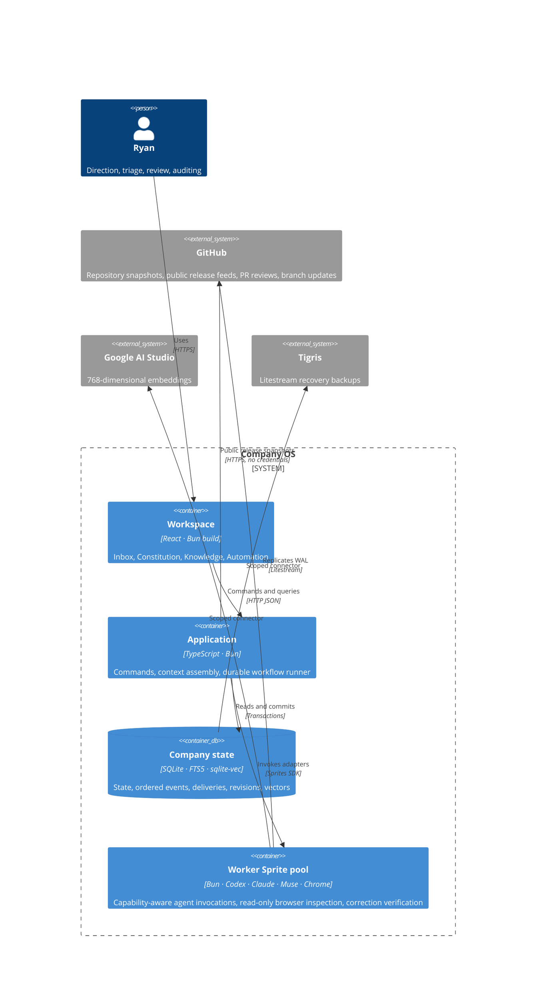

# Architecture

Company OS separates decisions about company state from HTTP, SQLite, agents, GitHub, embeddings and browser execution. The workflow is deterministic code; an agent supplies judgments and proposed outputs, never the next scheduler action.

## Code boundaries

| Layer       | Files                                                               | Responsibilities                                                              |
| ----------- | ------------------------------------------------------------------- | ----------------------------------------------------------------------------- |
| Domain      | `src/domain/model.ts`, `events.ts`, `workflows.ts`, `reviews.ts`, `discovery.ts`    | Valid commands, event payloads, event-to-effect mapping, review quorum, perspective selection and idea deduplication  |
| Application | `src/application/company.ts`, `context.ts`, `runner.ts`, `discovery.ts`, `ports.ts` | Use cases, context selection, transactions, executing effects through ports   |
| Adapters    | `src/adapters/sqlite.ts`, `agents.ts`, `github.ts`, `browser.ts`, `research-sources.ts`    | Persistence and external systems                                              |
| HTTP edge   | `src/server/index.ts`                                               | Authentication, read-only inspection sessions, parsing requests, wiring ports |
| UI          | `src/web`                                                           | Views and human commands                                                      |

The domain imports no network, Sprite, browser or database implementation. The application imports interfaces and domain rules. SQLite reuses the original document/revision/search store; old conversation and proposal tables are imported once. The old worker is retained for legacy recovery tests but is not started in production.

## Persistence and delivery

A command transaction saves state, appends ordered typed events, and stores each event's resulting deliveries atomically. Event envelopes have a sequence, UUID, schema version, actor, correlation ID, causation ID and timestamp. `src/domain/workflows.ts` defines triggers explicitly. This is a transactional outbox with current state, not an event-sourced replay engine.

A single application runner claims durable deliveries and overlaps them up to the configured Sprite-pool capacity. SQLite state transitions remain transactional. Restart returns interrupted deliveries to pending. Completed runs and review rounds are deduplicated. Sprite results are cached per run on the leased worker; remote execution has a lock to avoid concurrent retries. External effects are **at least once**: GitHub review comments carry a stable review ID; correction commits carry a stable run ID. GitHub and SQLite cannot share an atomic commit. Review quorum counts each review slot once. Delivery failures retry up to three times; exhausted failures appear in Work and the inbox. Failed agent invocations require explicit retry. Paused/budget-limited work stays queued.

Keep one Fly application Machine as the delivery owner and lease execution to the Sprite pool. This design does not support multiple application owners or zero-loss failover. Litestream backups are asynchronous.

## Context and present understanding

The primary navigation is Inbox, Constitution, Knowledge, and Automation; Settings is a utility control. Automation lists tasks with their own schedules, pause/resume and run-now controls, budgets, investigation limits and agent profiles. Settings separates workspace configuration, Foreman’s default agent profile and review policy. Both human-started conversations and agent requests appear in Inbox. New message opens a subject/body composer; each thread opens on a single reading surface, with replies and archiving. Constitution opens directly into the human-owned company direction, with editing, revision history, and discussion. Knowledge supports creating and editing all other documents, with optional context settings; versioning and indexing stay behind the application boundary. Work and experiment history are optional drill-downs inside Automation. Developed discovery recommendations expose their decision controls directly in their inbox threads.

Documents and observations share a canonical, versioned source. Each record has scope, inclusion (`always`, `relevant`, `reference`) and lifecycle (`active`, `draft`, `retired`). The constitution is the sole source of company direction: Settings has no separate objective. The constitution is always included and can only be edited by a human. Proposals cannot alter it.

The context assembler uses the same policy for preview and execution: constitution, explicit pinned attachments, eligible always-included records, then relevant retrieval hits. A 60,000-character document budget includes whole records; every exclusion has an inspectable reason. Draft, retired and reference-only records are excluded unless explicitly attached. Repository evidence, conversation, assignment and browser results are separate context sections. A preview is not a promise about a future retrieval result; each actual run saves its exact selected revisions and evidence.

Knowledge exposes the exact indexed title-and-text passages, keyword/semantic match reasons, inclusion policy and revision history, with direct editing from search results. Saving an edit invalidates old vectors immediately and emits `KnowledgeChanged`. The indexing effect checks the revision both before and after the remote embedding call. Only current vectors can become searchable. Keyword retrieval remains available during reindexing or provider failure. Historical run contexts do not change. Agent findings enter understanding as attributed observations or hypotheses; proposed revisions to existing documents require acceptance in an inbox thread.

## Execution boundaries

Discovery uses rotating perspectives and event signals to investigate hypotheses before asking for a decision. Assessments and outcome checks feed versioned understanding through the normal indexing workflow. Each task owns its run allowance, active idea capacity, open-work limit, investigation limit, provider, model and reasoning effort. Foreman has a separate default profile in Settings. Every run snapshots its resolved profile when queued, and the pool leases only a worker authenticated for that provider. Scouts and follow-up work charge the owning task; no shared exploration pool or reserved-slot classification remains. Paused queued tasks do not stop other due tasks. The deterministic lifecycle is in `src/application/discovery.ts`; selection and novelty rules are in `src/domain/discovery.ts`.

Pursued work supports research, bug and feature tracks; its executors perform investigation or a bounded live UI inspection. Investigation can discover implementation work and escalate it. General feature implementation and PR creation are not yet executors.

PR reviews are implemented for linked same-repository PRs, with separately authorized source corrections. See [WORKFLOWS.md](WORKFLOWS.md). No automatic merge or deployment exists. Reviewers are independent context-isolated invocations and inherit the owning automation profile or Foreman default; they still share one GitHub identity and are not independent human approvals.

Browser inspection opens the actual app in Chrome at desktop and phone widths, navigates primary views, saves screenshots, and records console errors and overflow. Its signed session expires after ten minutes and the server rejects mutations. Screenshot context reaches the agent. This is bounded navigation, not an unrestricted agent-controlled browser.

The app uses a private session, same-origin checks, no-store API responses, and private artifact routes. Codex login stays on the Sprite. Provider credentials stay in connectors. Inspection cookies are temporary read-only capabilities. The PWA caches only public icons and an offline screen.

## Empty workspaces and legacy examples

New databases contain no documents, conversations, work or findings. The interface offers a blank constitution editor; new autonomous exploration waits until a constitution exists. Exploration perspectives are configuration, not invented company knowledge.

A compatibility migration archives only the four original bootstrap documents when their ID, first revision, source and content fingerprint still match. Authored revisions and real learned findings remain. Archived starters are removed from keyword and vector search and ordinary context selection; historical revisions and recorded run contexts remain readable. Nothing recreates the examples on restart. Test/example documents live exclusively in `tests/fixtures`.

## Subject library and agent briefings

`src/application/library.ts` maintains the library through the existing repository, agent and event ports. `CompanyState.library` records subject organization and the pending/processed source revisions. Product, architecture, and execution documents remain human-governed specifications. Knowledge shows these alongside canonical subject pages grouped into collections; raw machine findings remain in Evidence, and are excluded from ordinary retrieval unless explicitly attached. Library relationships expand retrieval through parent guidance and one hop of related subjects. Organization never bypasses scope, retirement or reference-only policies.

New documents and findings emit `KnowledgeChanged`, which queues both indexing and `QueueLibrarySource`. A dedicated Knowledge library task consumes pending evidence on its own schedule and run allowance. A pass processes up to three sources, receives a bounded subject catalog, and can create or revise up to four subjects. It has no database or free-form search access. Missing full pages can be supplied through one application-controlled supplemental briefing. New assertions must cite supplied evidence, while stale edits, cycles, duplicates and governing-document rewrites are rejected transactionally. The model is responsible for synthesis and identifying semantic contradictions; this is not a deterministic fact checker. Human-edited pages always require approval, irrespective of the model's recommendation.

The briefing assembler uses the assignment, thread subject, opening intent, running conversation summary and recent exchanges. It injects current eligible pages and a current constitution. Explicit attachments pin other documents to the selected revision. A run saves its exact context; additional context appends material without replacing already supplied revisions. Both initial and expanded briefings are retained, including on retry. At most two agent invocations are permitted per logical run. Later replies assemble fresh context and preserve earlier snapshots. A bounded running summary carries older agreements forward; the original thread messages remain stored.

`src/domain/briefing.ts` renders four explicit prompt sections: constitution, relevant knowledge, conversation, assignment, followed by supporting execution evidence. Retrieved text is attributed evidence, not authority to override the agent's operating rules. When semantic retrieval is unavailable, keyword selection remains available and the briefing discloses the limitation. Constitution content is never silently dropped to satisfy the knowledge allocation. Other knowledge shares a 60,000-character allowance; conversation excerpts and evidence have separate bounds.

The inbox renders actual run snapshots rather than recomputing what a past reply might have seen. The library editor remains subject plus Markdown content; optional organization and revision history sit on the reading page. No synthetic subject pages or findings are seeded during migration. Human-created legacy knowledge becomes Unfiled subjects, machine-created notes become pending evidence, and document IDs and revisions are retained.
