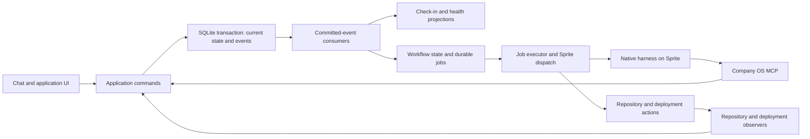

# Company OS v2 design

Status: proposed implementation design, based on Ryan's design discussion. This document does not authorize implementation or production cutover by itself.

Date: 2026-09-21

Reading guide: [Product experience](#2-product-experience) · [Domain and authority](#3-domain-model) · [Tasks and delivery](#4-tasks-milestones-and-delivery) · [Automations](#5-automations-and-workflow-authoring) · [Library](#6-intake-and-the-maintained-library) · [Agent runtime](#7-native-agent-runtime-and-mcp) · [Events](#8-events-consumers-and-durable-execution) · [Storage](#9-storage-and-application-boundaries) · [Quality and KPIs](#10-visual-quality-gameplay-feel-and-kpis) · [Recovery](#11-reliability-observation-and-recovery) · [User journeys](#13-complete-user-journeys) · [Acceptance](#14-verification-and-acceptance-of-v2) · [Build sequence](#15-implementation-sequence) · [Cutover](#16-in-place-cutover) · [Remaining decisions](#19-remaining-inputs-and-decisions)

## 1. Purpose and scope

Company OS is the operating system for Ryan's software studio: Ryan provides direction and creative judgment, and agents carry out the software work. The studio will build an open-source, browser-based game engine and games with ambitious visual quality and gameplay feel.

This is a bespoke application for one studio and one human operator. Design the vocabulary, workflows, prompts, library, and interface around that studio. Do not build tenant management, organizational hierarchies, a generic business platform, or a marketplace of workflow integrations. Sales, finance, and other business administration are outside v2's scope.

V2 replaces the current application in place. Backward compatibility, migration of the current database, and preserving old execution semantics are unnecessary. The existing Sprite pool and useful infrastructure can be reused. The complete operating system described here is the target; implementation stages are a build sequence, not a reduced product scope.

### 1.1 Decisions established in the discussion

| Area | Decision |
| --- | --- |
| Agent interface | Company OS exposes an MCP server. Agents use it from native model harnesses running on Sprites. |
| Execution | Native harnesses have full access inside their Sprite environment. Company OS prepares the environment deterministically. |
| Foreman | The central conversational persona, with broad operating authority. Specialists act within assigned work. |
| Approval | Ryan approves constitution changes and milestones. Do not add routine human approval gates for reviews, library edits, merging, deployment, or quality ratings. |
| Work | A milestone is a concrete implementation effort. One-off work must have a direct task path. |
| Automation | Preserve the current automation product model: distinct tasks, instructions, execution profiles, schedules, limits, pause, and run-now. No separate central Foreman heartbeat. |
| Events | One canonical, durable domain-event stream in SQLite. Background consumers react to committed events. Ordinary current-state tables remain authoritative for their records. |
| Workflows | First-class domain concept, defined by maintainers in code. |
| Knowledge | Intake exists solely to feed maintained knowledge. The library needs organization and centrally defined document templates selected by Foreman. |
| Interface | Chat is the primary experience. Use shadcn components and Tailwind throughout. Add separate Check-in and System health pages. |
| Shipping | A change is shipped when merged into main and included in a successful deployment to its intended environment. |
| Quality | Visual quality and gameplay feel are separate dimensions, scored by Ryan and an independent review agent, with a combined result. |
| Efficiency | Prepare work, context, and bookkeeping in code; design stable instructions and sessions for token-cache reuse. |

### 1.2 Proposed defaults, not settled decisions

The implementation recommendations below make the design concrete. These defaults are distinguishable from Ryan's explicit requirements:

- A bounded bug fix or maintenance change can be a one-off task that Foreman ships directly. A coordinated new capability requires a milestone. Section 4 defines the boundary.
- Quality ratings use an anchored 1–10 scale, with a 75% Ryan / 25% reviewer combination per dimension.
- Library templates and workflow definitions live in the repository. Automation configuration, role instructions, and model routing are editable in the application.
- Intake bodies are disposable after successful curation, following the existing product's useful behavior. Durable source references and curation receipts survive.
- Keep Bun, TypeScript, React, SQLite, Fly, and the existing backup infrastructure where they remain suitable. Verify runtime versions and sizing during implementation.
- Start with one active invocation per Sprite, one SQLite owner, and bounded concurrent dispatch across the healthy pool.
- Use two independent code reviewers and at most two correction cycles by default, retaining the existing delivery model's useful limits. A milestone can specify a different policy; preserve all findings and attempt history.

The first game, exact engine strategy, target hardware, reference games, quality anchors, and managed repository deployment commands are intentionally not invented here. They are studio configuration and direction inputs, listed in section 19.

### 1.3 Product success

Ryan can discuss an idea without accidentally authorizing work; ask for a bounded task without creating a milestone; approve a substantial implementation effort; continue chatting while agents work; inspect a deployed build; rate its appearance and feel; and see that feedback influence subsequent proposals. Automations maintain knowledge and move authorized work forward without repeated manual intervention.

Ryan can understand what is happening through Check-in and diagnose a failure through System health without depending on Foreman to explain a broken system.

## 2. Product experience

### 2.1 Navigation

Primary destinations are Chat, Check-in, Library, and Work. System health and Settings remain readily accessible utility destinations. Work contains tasks, milestones, and automations. Library exposes its hierarchy, search, and a secondary Intake view. Constitution has a clear dedicated entry within the workspace and can be opened from relevant conversations.

On desktop, related documents, proposals, work items, and playable builds can open beside the conversation. On small screens, use focused detail views with preserved navigation, scroll position, and drafts. Do not crowd the mobile interface with the desktop layout.

### 2.2 Chat with Foreman

Chat is where Ryan directs the studio, thinks aloud, asks questions, reviews proposals, and follows up on work. It is a complete product surface, not a diagnostic transcript.

Requirements:

- Stream meaningful response text as the native harness makes it available. Display an immediate submitted/queued/working state before the first model token; never invent progress to disguise latency.
- Render Markdown, code, images, clips, citations, and domain objects well. Use readable line lengths, restrained metadata, and clear speaker distinction.
- Support a substantial multiline composer, attachments, keyboard operation, draft preservation, send, stop, and follow-up messages while work is active.
- Preserve scroll position while reading older messages. Follow streaming output only when the reader is already at the bottom; otherwise show an unobtrusive new-content affordance.
- Reconnect without duplicate messages or loss of completed replies. Distinguish a lost browser connection from a failed agent run.
- Allow multiple durable conversations. Each has its own history, attached work, and selected context. Cross-conversation context is retrieved intentionally rather than concatenating every conversation.
- Surface status as concise actions such as inspecting a build or preparing a proposal. Detailed tool calls, receipts, and logs are an expansion, not the conversation's default content. Do not expose private model reasoning.
- Link background work back to its originating conversation. Routine automation events do not create a flood of messages. Meaningful results and requests for input are deduplicated and delivered once.
- Keep the conversation usable during long-running work. Foreman delegates substantive execution to workflow steps and specialist runs instead of monopolizing the chat turn for the entire assignment.
- A proposal is a versioned domain object embedded in the conversation. Ryan can discuss it, inspect changes, and approve the exact visible revision. Duplicate or stale approval submissions are handled explicitly.
- Treat uncertainty and discussion naturally. Foreman distinguishes exploration, requests for answers, task delegation, and milestone authorization. Do not make every conversation a plan, task, or milestone.

Message submission durably creates a message and turn request before returning success. Client-generated submission keys prevent double sends. The transport provides a resumable stream of persisted message blocks and run status. Streaming chunks use a dedicated transport/log sequence, not individual domain events. Persist in bounded batches; after a crash, retain partial text as interrupted rather than presenting it as a complete answer.

Follow-up messages are always saved. If the harness supports mid-turn steering, the adapter delivers them and records acknowledgment. Otherwise, they become a follow-up turn or an explicit stop-and-restart with prepared context. The interface must not say an instruction was applied before the worker acknowledges it. Work revisions and stale-result checks protect against a previous instruction completing later.

The chat persona can say what happened in prose. Durable application changes happen through explicit domain commands over MCP; parsing the prose is not the mutation protocol.

### 2.3 Check-in

Check-in answers: what is the studio working on, what changed, and where does Ryan need to contribute?

Show:

- Current objectives and the engine/game experiences they concern.
- Active milestones and one-off tasks, with purpose, current step, most recent meaningful progress, and next expected action.
- Running, queued, blocked, and paused work as distinct states. Show wait reasons instead of fabricated completion percentages or completion times.
- Pending constitution and milestone decisions, requests for missing information, and builds awaiting Ryan's quality rating. These are different categories; a rating is not an approval gate.
- Recent shipments with source revision, environment, screenshots/clips when available, and playable build links.
- Visual-quality and gameplay-feel trends for comparable evaluation scenarios, plus relevant product and delivery measurements.

Use durable state and projections for factual status. An optional Foreman summary adds interpretation with an as-of time and links to the underlying records. The page remains correct and useful when summary generation is unavailable. Read/unread attention is per item; a technical failure should not turn every page into an alert banner.

### 2.4 System health

System health answers whether Company OS can execute its responsibilities and how to recover when it cannot.

Show event-consumer lag, scheduler activity, failed or dead-lettered work, stuck/unknown runs, Sprite leases and availability, harness authentication and capabilities, connector failures, deployments, SQLite and disk health, backup freshness and restore verification, token usage, cached-token measurements, and spending/allowances.

Every actionable issue has observed evidence, last checked time, affected work, and a specific recovery action. An elapsed-time threshold means investigate; it is not proof that a worker died. Controls include retry, reconcile remote state, cancel, pause automation, pause dispatch globally, and inspect logs. Domain validation and audit records apply to these controls too.

Liveness is independent from downstream provider health. Avoid restarting the SQLite owner repeatedly because a provider or Sprite is unavailable.

### 2.5 Interface standard

Use shadcn primitives and Tailwind styling for layout, forms, dialogs, tabs, menus, trees, tables, and accessible interaction. Build a small coherent set of application components for chat messages, work summaries, proposal cards, build previews, and rating forms. Use custom rendering where the content requires it, such as game previews, while keeping the surrounding controls consistent.

Explicit quality requirements include keyboard navigation, visible focus, accessible labels and status announcements, sufficient contrast, reduced-motion behavior, stable layouts during streaming, useful empty/error/loading states, mobile keyboard behavior, and preservation of in-progress writing. No token-count or execution-lease vocabulary in ordinary work flows unless Ryan opens diagnostics.

## 3. Domain model

Model the studio directly. An engine and its games are concrete studio entities, not instances of a generalized tenant system. Support multiple studio repositories where needed without assuming that engine and games must be separate repositories.

| Concept | Responsibility |
| --- | --- |
| Constitution / revision / proposal | Studio mission, direction, operating principles, and approved changes. |
| Objective | An intended studio or product outcome, current priority, and evidence of progress. It does not authorize a new implementation milestone. |
| Engine / game / repository | What is being built, its code locations, deployment targets, and relationships. |
| Task | A bounded unit of work, its assignment, context, result, and lifecycle. May stand alone or belong to a milestone. |
| Milestone / revision / approval | An implementation outcome with scope, acceptance criteria, task dependencies, allowances, and a fixed approved revision. |
| Automation | Configured recurring or event-driven Foreman responsibility, including instructions, triggers, execution profile, and limits. |
| Workflow definition / instance / step | Maintainer-defined progression and its durable execution state. |
| Role / execution profile | Assignment instructions and model/harness configuration. Roles describe responsibility; model selection is separate. |
| Run / attempt / session | One logical agent invocation, its execution attempts, native session association, context snapshot, usage, and outcome. |
| Conversation / message / attachment | Human interaction, agent replies, and links to domain objects. |
| Intake / curation receipt | Temporary material awaiting incorporation into maintained knowledge. |
| Collection / document / revision / template | Organized library, content history, document kinds, and central starting structure. |
| Source / citation | Evidence with provenance, retrieval date, status, and durable references. |
| Build / deployment / artifact | Exact executable output, deployment evidence, playable URLs, images, clips, and reports. |
| Review / finding | Independent assessment tied to exact work or build revisions. |
| Quality evaluation / rating | A pinned build/scenario/rubric and independent Ryan/reviewer assessments. |
| Metric definition / observation | Versioned measurement rules and source-derived values. |
| Event / consumer / job / timer | Committed facts, durable reactions, and scheduled execution. |

Assets need source and licensing metadata, content identity, and links to builds that use them. Store assets in the appropriate managed repository or artifact store; do not build a full digital asset management product as part of v2.

### 3.1 Constitution and authority

The active constitution revision is supplied to every agent invocation. Foreman can propose changes but cannot commit them as approved. Ryan's authenticated action activates a specific proposed revision. Initial studio setup uses the same human-authored/approved principle; an empty installation must not invent and approve its own constitution.

Foreman has standing authority to answer questions, investigate, create and dispatch bounded tasks, maintain knowledge, propose milestones, supervise approved work, arrange reviews/corrections, and ship authorized changes. Specialists act within an existing assignment; they report a needed scope expansion to Foreman rather than initiating unrelated work.

Roles and operating boundaries are primarily instructions. Do not build a granular RBAC system. Keep a few server-enforced distinctions:

- Only Ryan's authenticated identity can approve constitution changes or milestone revisions.
- The server validates document revisions, workflow transitions, idempotency, assignment identity, active dispatch generation, and available allowances.
- Current cancellation, pause, and constitution constraints are checked at the next controlled transition. Later grants do not silently rewrite a run's original assignment.
- A significant expansion of an approved milestone becomes a revised proposal requiring approval. Rearranging steps within its existing scope does not.

Use a run-associated MCP credential so attribution comes from the server rather than a model-supplied actor field. Ryan's browser session is a separate credential. Do not place the production database, human session credentials, or server administration secrets in Sprites. Basic authentication and these narrow invariants are compatible with full access inside the worker environment.

Full-access agents with external credentials can act outside the prescribed workflow. Prompt authority is a trust model, not a guarantee of confinement. External reconciliation must detect deviations; exact limits cannot be promised for commands already sent to third parties.

## 4. Tasks, milestones, and delivery

### 4.1 Work classification

Tasks cover bounded research, diagnosis, support investigation, library work, code review, and small implementation/maintenance changes. Examples include investigating an animation artifact or correcting an isolated editor bug.

Milestones represent coordinated implementation efforts: a new engine capability, an editor workflow, or a playable game experience with explicit acceptance criteria. Knowledge-only research does not need to masquerade as an implementation milestone.

Classification depends on the overall intended outcome, not a count of files or subtasks. Foreman may not divide an unapproved feature into many one-off tasks to evade milestone approval. The proposed default is that routine bounded fixes can ship directly; new capabilities and substantial experience changes require a milestone. Capture the final boundary in the constitution and Foreman instructions.

Each task has an outcome, boundaries, role, evidence requirements, repository/build context where applicable, and a completion contract. A task can finish with a research result, accepted code, or a resolved diagnostic question. Only delivery work has a shipping state. Intake is a possible output, not the task's lifecycle record.

### 4.2 Milestone contract

An approved milestone snapshots:

- Intended outcome and relationship to an objective, engine capability, or game experience.
- Included scope, explicit boundaries, and acceptance criteria.
- Dependencies and initial assignments; allow deterministic scheduling of independent steps.
- Applicable studio requirements and review/correction policy.
- Model/run/spending allowances and deployment targets.
- Required build evidence and applicable quality-evaluation dimensions, rubric version, and references.

Approval applies to an immutable revision. A pending revision does not silently replace active approved scope. Foreman may refine implementation details within the approved outcome. Changes to outcome or boundaries create a new approval revision. Budget exhaustion records a pause; Foreman cannot reset the allowance by cloning the work.

Suggested lifecycle: draft → proposed → approved → active → ready for integration → merged → deploying → shipped. Paused, blocked, cancelled, rejected, and superseded are explicit states where relevant. Implementation acceptance and subjective quality assessment are separate records from shipping.

### 4.3 Code review, integration, and deployment

The delivery workflow prepares real checkouts and lets native harnesses use normal development tools. It does not constrain implementation to generated replacement files or a small extension allowlist.

1. Prepare an assignment checkout at a known base with relevant dependencies and instructions.
2. Run implementation and collect the exact commit/tree, checks, artifacts, and result through MCP and executor receipts.
3. Start independent review against the exact candidate. Reviewers do not see each other's judgments until their own submission is sealed. Record material findings, evidence, and disposition.
4. Run bounded correction cycles. A changed candidate invalidates approval for the previous candidate; deterministic checks and review policy establish what must rerun.
5. Integrate against the current target, verifying the final candidate and applicable CI. Resolve concurrent main changes without overwriting them. Missing or pending required checks are waits, not passes.
6. Merge to main through the managed repository's configured policy. Observe authoritative repository state rather than trusting a successful-looking agent message.
7. Deploy the merged change to each required environment, verify the resulting revision/build and required smoke checks, and record deployment evidence.
8. Record shipping once all required facts exist. Schedule applicable quality evaluation and publish a concise outcome in the originating conversation and Check-in.

Company OS's own repository currently requires direct commits to main without PRs unless Ryan asks for one. Respect that rule when implementing v2. Managed repositories have explicit integration policies; do not assume PRs are mandatory everywhere or bypass branch protections. Support direct-main integration and PR-based integration through the same reviewed-candidate contract.

With multiple required reviewers, all required material findings must be resolved or explicitly adjudicated; do not average a blocking correctness issue away. After the configured correction limit, an independent adjudication step may dismiss an unsupported finding or identify a blocker within the existing allowance. It may not create endless replacement tasks to reset the limit. Unresolved work remains blocked and visible to supervision. Review noise and adjudication decisions remain inspectable.

A merge without a successful deployment is “merged, deployment pending/failed,” not shipped. A successful deployment of unrelated main work does not establish that this change shipped. Match commit ancestry or verified tree/artifact provenance where squash/rebase transforms identities. A multi-repository milestone records the required repository revisions and deployment mapping explicitly.

For an engine package, deployment can mean publishing its configured distributable plus deploying a required demo/test experience. For a game, it normally means a playable environment. Ryan configures which targets count; a temporary preview does not automatically satisfy the shipping contract.

Shipping is a historical fact. A later rollback or regression changes current deployment/health state and creates follow-up work without deleting the shipment record. Recovery workflows can roll back under standing authority, using observed deployment identity and the repository's release policy.

## 5. Automations and workflow authoring

### 5.1 Preserve the automation product model

An automation is an editable assignment to Foreman, not a separate employee or a generic infrastructure heartbeat. Each has a name, purpose, instructions, workflow type, event subscriptions and/or schedule, model profile, allowance, concurrency/coalescing policy, pause state, and run history.

Examples:

| Automation | Trigger | Responsibility |
| --- | --- | --- |
| Knowledge curation | Ready intake, with deferred-work schedule | Incorporate, discard, or defer material and maintain library organization. |
| Milestone planning | Schedule or manual request | Propose concrete implementation efforts grounded in studio direction and observed needs. |
| Work supervision | Relevant work events and optional recurring schedule | Resolve routine blockers, inspect stalls, and advance authorized work. |
| Research | Schedule or explicit request | Investigate a specified engine/game question and submit useful findings to intake. |
| Quality review | Eligible shipped build or explicit evaluation request | Independently evaluate applicable dimensions against the fixed rubric. |

Initial automations are studio-specific. Do not copy every existing generic business-discovery perspective into the new installation. Planning may legitimately produce no proposal. Full capacity, weak evidence, or lack of a worthwhile implementation outcome should suppress busywork.

Schedules have an explicit timezone and daylight-saving behavior. Use a unique automation/scheduled-occurrence key to prevent duplicate starts after restarts. Proposed missed-run policy: coalesce missed ticks into one eligible invocation rather than replaying an overnight backlog of identical planning calls.

Pause prevents future dispatch, while an already-running agent may finish unless cancelled. Run now creates one explicit invocation without enabling the schedule and still observes global limits. Define the allowance period and reset boundary in settings; snapshot usage attribution to the originating automation and milestone/task so retries and delegation remain chargeable. A follow-up does not acquire a fresh allowance just because another role executes it.

Event-triggered runs coalesce by the relevant domain key. If intake arrives during curation, preserve its pending marker for the next pass. If an automation is paused or limited, record deferred work and resume it when eligible; do not consume the event and lose the obligation.

There is no central Foreman heartbeat. A deterministic scheduler and health monitor still run continuously. Their timers do not imply recurring model calls.

### 5.2 Workflow definitions

Maintainers define workflows as typed TypeScript modules. Keep the authoring surface small: an ID/version, accepted trigger schemas, instance key, state schema, and transition handlers that produce durable steps, timers, or domain commands.

Support deterministic steps, agent steps, waits for domain facts, timers, conditional transitions, parallel branches with joins, bounded retries, cancellation, and terminal outcomes. Do not build a visual workflow editor or custom scripting language for users.

Workflow instances pin a definition version. Deployments must retain handlers for active versions, explicitly migrate instances, or drain them; changing code must not silently reinterpret in-flight steps. The cold v2 cutover needs no v1 workflow migration, but v2's later deployments still need this contract.

Illustrative definition shape (design pseudocode, not a selected library API):

```ts
defineWorkflow({
  id: "knowledge-curation",
  version: 1,
  trigger: "intake.ready",
  instanceKey: () => "studio-library",
  steps: [
    deterministic("prepare-batch"),
    agent("curate", { role: "foreman-curator" }),
    deterministic("commit-resolution"),
    deterministic("schedule-next-batch-if-needed"),
  ],
});
```

The definition describes progression, not unrestricted agent-written code. Agent judgments can select among valid transitions or create allowed domain commands through MCP. Code owns bookkeeping, step identity, persistence, and execution scheduling.

Workflow completion cannot depend only on a model saying it succeeded. The step contract specifies required records: a curation resolution, a submitted review, observed merge/deployment evidence, or another concrete outcome. An agent can return a blocker when it cannot meet the contract.

## 6. Intake and the maintained library

### 6.1 Intake boundary

Intake is exclusively a loading area for knowledge: research findings, source excerpts, observations, and other material that may improve the library. It is not the inbox, task queue, incident registry, execution log, or general event bus.

Proposed lifecycle: collecting → ready → claimed for curation → incorporated/discarded, with deferred and failed outcomes retaining the material. Human drafts remain collecting until ready. Workflows may require review of a particular research revision before marking it ready; this is an automated quality step, not an additional routine human approval gate.

The curator receives a deterministic bounded batch, relevant library entries, the library tree, template catalog, and source references. It resolves each item explicitly. One item can affect several pages, and several items can update one maintained page. A failed or stale batch cannot delete its inputs.

Commit validated document revisions and intake resolutions together. Under the proposed disposable-intake policy, delete processed intake bodies and their search entries only after that commit is valid. Preserve a receipt linking input identities, source references, resolution reasons, and resulting document revisions. Knowledge citations must not depend on deleted intake bodies. Original sources or separately retained artifacts have their own retention rules.

Task completion does not automatically wait for curation. A workflow can explicitly wait when downstream work depends on incorporated knowledge. Otherwise, dispatch downstream work with the accepted task result and curate independently.

### 6.2 Organization

Collections and nested sections define where pages belong. Each document has one primary home and explicit relationships to other documents, engine systems, games, and relevant assets. Related links avoid duplicating the same content across collections. Enforce acyclic hierarchy, stable IDs, valid moves, and aliases/redirects when consolidating documents.

Foreman may create/move collections, organize pages, merge duplicates, and archive obsolete knowledge as part of curation or a maintenance assignment. Human edits receive the same revision/concurrency protection but are not protected by a blanket additional approval requirement. Constitution remains separate and human-approved.

Search spans titles, aliases, summaries, content, and headings, with keyword and semantic retrieval. Show a tree for browsing and clear document kinds. Intake is discoverable in its own view and explicit attachments, but excluded from ordinary maintained-knowledge retrieval.

### 6.3 Central document templates

A template defines kind ID, version, purpose, when to choose it, initial Markdown sections, field guidance, and limited structural validation. New entries start from that template, populated by Foreman or Ryan. Templates provide consistency without forcing every page into one universal schema.

Initial proposed kinds:

| Kind | Intended content |
| --- | --- |
| Studio/subject overview | Purpose, current understanding, relationships, and open questions. |
| Game design | Intended player experience, mechanics, interactions, constraints, and unresolved design questions. |
| Engine subsystem | Responsibilities, architecture, interfaces, invariants, tradeoffs, and links to implementation. |
| Art direction | Visual intent, references, composition/material/lighting guidance, and evaluation anchors. |
| Asset specification | Purpose, technical requirements, provenance/licensing metadata, and acceptance references. |
| Decision record | Status, decision, context, alternatives, consequences, and actual authority/source. |
| Research synthesis | Question, findings, sources, uncertainty, implications, and next investigations. |
| Performance study | Build, scene, hardware/browser profile, methodology, measurements, and interpretation. |
| Procedure | When to use, prerequisites, steps, verification, and recovery. |
| General knowledge | Useful material that does not yet justify a dedicated kind. |

Templates live centrally in the repository as a proposed default. Foreman chooses from the catalog; adding a new central kind is a normal repository change. Template revisions never silently rewrite existing documents. Record the applied version and use deliberate upgrade tasks when a structural change is useful. Foreman may add useful subsections and omit inapplicable optional sections with an explanation.

### 6.4 Revisions, provenance, and retrieval

Store immutable document revisions, citations adjacent to supported claims, source identity and retrieval date, knowledge status, and relevant review dates. Differentiate observed fact, hypothesis, proposal, and accepted decision. A research finding cannot declare a company decision merely by appearing in a decision template.

Use optimistic revision checks for edits. Support targeted text/section changes and explicit full replacement when the complete current page has been supplied. Partial context never silently authorizes replacing unseen content.

Knowledge changes emit indexing events. Index only the current revision; stale indexing results cannot replace current passages. Mark stale or superseded entries and propagate source-change concerns to dependent knowledge. Known source withdrawal or scheduled source refresh is observable; do not claim arbitrary website changes are automatically detected without a configured observation mechanism.

Prepared agent context contains the constitution, stable role/workflow instructions, selected relevant knowledge, and the current assignment/conversation. Record the exact revisions and excerpts used. MCP lets the agent discover the tree, search, inspect headings, and fetch additional content without restarting a custom context-request loop.

## 7. Native agent runtime and MCP

### 7.1 Runtime boundary

The Company OS server owns domain state, workflow execution, context preparation, dispatch, and reconciliation. A Sprite runs the provider's native harness with normal native tools and full access to its worker environment. Company OS exposes its domain functionality through MCP rather than recreating shell, file, browser, or generic model tool execution.

Use a remote authenticated MCP endpoint on Company OS. Native harness configuration is generated before each invocation. Codex remote MCP support is documented in the official sources in section 20. Verify the exact installed capabilities of every other harness before declaring support.

The existing baseline includes Codex, Claude Code, and Muse. Proposed support policy: each configured harness must pass the same contract tests for MCP, authentication, native tool use, streaming/status capture, cancellation, output recovery, and usage reporting. Capability differences must be explicit. Do not hide a missing MCP capability behind a replacement bespoke model loop. Exact provider/model coverage is an implementation verification item.

A small adapter per harness is appropriate. It starts or resumes the native process, maps its observable messages into the chat/run transport, records usage where available, cancels it where supported, and recovers completion receipts. It does not implement reasoning, tool selection, or the provider's internal agent loop.

### 7.2 Deterministic preparation

Before dispatch, code performs the repeatable setup:

1. Reserve a run identity and allowance; claim a healthy compatible Sprite with a fenced lease.
2. Prepare a dedicated run directory and clean checkout/workspace at the intended revision. Keep reusable dependency caches separate from run state.
3. Install/configure required project dependencies through defined setup steps, verifying the environment baseline. Reuse successful preparation where its inputs match.
4. Materialize the stable role/workflow instructions, constitution revision, selected knowledge, artifacts, assignment, and completion contract.
5. Configure MCP, provider authentication, allowed external integrations, working directory, and native harness options. Full access is intentional; do not disable normal tools for non-engineering roles.
6. Persist the context/configuration snapshot and dispatch attempt before starting the remote command.
7. Start the harness, stream observable output, and reconcile its final process and domain outcomes.

The agent can inspect more, install tools, change files, and pivot within its assignment. Preparation removes routine discovery and bookkeeping; it does not pretend every useful action can be predicted in advance.

Each run owns a stable remote receipt location and attempt marker. A transport timeout does not prove that execution failed. Reconcile an existing process/receipt before launching another attempt. Never delete a running marker blindly to make a retry proceed.

### 7.3 MCP surface

Expose a compact, coherent domain interface rather than generic table CRUD or an arbitrary event-emission tool. Example operation families:

| Area | Example operations |
| --- | --- |
| Context | Read constitution, inspect current assignment, fetch linked artifacts and work context. |
| Library | List tree/kinds/templates, search/read pages, submit revision-checked edits, organize entries. |
| Intake | Submit ready/collecting material, inspect a curation batch, commit batch resolutions. |
| Work | Read work, propose/revise milestones, create bounded tasks, record blockers/results. |
| Execution | Read workflow step contract, submit evidence/receipts, acknowledge a steering message. |
| Review | Submit code review findings, report acceptance evidence, submit a sealed quality rating. |
| Builds | Register build/artifact references, request a configured deployment, inspect observed deployment state. |

Operation names and schemas are finalized during implementation. Mutation requests carry a request key and relevant expected revision. Actor, role, assignment, and lease generation are derived from authenticated run context. The server applies validated commands and emits events; agents cannot manufacture arbitrary authoritative facts such as a verified deployment.

Ryan-only approval commands are exposed through the authenticated human application path, not an agent credential. Use the same application services behind UI and MCP so domain behavior does not diverge between transports.

For quality evaluation, the review context and evaluation read path withhold Ryan's sealed rating until the reviewer submits. This narrow blind-review rule supports independent judgment; it is not a general permission framework. Reviewers must not have direct access to the production database or human session.

### 7.4 Sessions and caching

Separate durable Company OS conversation/workflow identity from native harness session identity. Continue the same native session when following up on the same work and when supported. A new subject, independent review, or unrelated automation gets its own context boundary. If a worker/session is lost, reconstruct from saved domain context and clearly record the new native session.

Keep tool definitions, ordering, shared instructions, role instructions, and reusable reference text stable. Put run IDs, timestamps, retrieved changing context, and assignments later in the prompt/context. Append conversation turns rather than repeatedly rewriting all prior messages. Partition reuse by coherent role/workflow rather than injecting every studio document into every run.

Provider caching depends on rendered-prefix matching and provider/harness-specific cache boundaries and retention. Stable text alone does not prove a cache hit. Native harnesses own provider request construction; use only their supported caching controls and do not create a custom model loop to force unsupported settings. Record cached/uncached input, output, reported cache-write usage where available, latency, and total cost. Missing usage is unknown, not zero. Measure representative repeated runs before claiming savings.

Do not optimize cache-hit percentage at the expense of bloated prompts, stale context, or irrelevant persistent sessions. Constitution or role changes intentionally change the relevant prefix.

### 7.5 Sprite pool

Reuse the existing provisioned pool after capability and authentication checks. The existing README lists studio worker names, while deployed configuration may enable only a subset; discover and verify the actual enabled pool at implementation time instead of assuming all ten are active.

Default to one active agent invocation per Sprite. Keep credentials, native configuration, run files, and checkout changes isolated between assignments; separate reviewer workspaces from implementation workspaces. A lease has identity, generation, expiry, and renewal. Generation checks fence stale workers from current MCP mutations. Lease expiry alone does not make a still-running external process safe to duplicate.

Reserve or prioritize capacity for interactive chat and use fair scheduling for background work so one category does not starve the other. Provide explicit queue reasons when all compatible capacity is occupied.

Sprites can build and inspect browser software, but the available runtime must not be assumed to represent target GPU hardware or human input latency. Record renderer/hardware information for captures and tests. Real-device and Ryan playtests remain distinct evidence; unsupported graphics/input capabilities yield unavailable assessments, not fabricated passes.

## 8. Events, consumers, and durable execution

### 8.1 Canonical event envelope

Maintain one append-only stream of meaningful domain facts. The proposed envelope is:

```json
{
  "id": "evt_unique_id",
  "sequence": 1842,
  "envelopeVersion": 1,
  "type": "deployment.verified",
  "typeVersion": 1,
  "occurredAt": "2026-09-21T18:40:12.000Z",
  "recordedAt": "2026-09-21T18:40:12.120Z",
  "actor": {
    "kind": "system",
    "id": "deployment-observer",
    "runId": null
  },
  "subject": {
    "kind": "deployment",
    "id": "dep_unique_id",
    "revision": 2
  },
  "correlationId": "workflow_unique_id",
  "causationId": "evt_prior_event_id",
  "source": {
    "kind": "deployment-provider",
    "externalId": "provider_delivery_unique_id"
  },
  "payload": {
    "buildId": "build_unique_id",
    "repositoryId": "repo_engine",
    "commitSha": "0123456789abcdef0123456789abcdef01234567",
    "environmentId": "env_playable",
    "verificationArtifactId": "artifact_unique_id"
  }
}
```

The database assigns the monotonically increasing sequence. It defines local committed order, not an assertion about the physical order of remote events. `occurredAt` captures an external occurrence where known; `recordedAt` captures ingestion. Sequence gaps are valid. Envelope and payload schemas are runtime-validated and versioned separately. Actor/run identity is trusted server metadata. Correlation traces a workflow or initiating request; causation names the immediate triggering event when one exists. Synchronous commands with no triggering event can have null causation and use their request identity for correlation.

Store indexed envelope fields as columns and the typed payload as JSON. There is one authoritative stored representation, serialized into the envelope on reads. Avoid maintaining inconsistent copies of the sequence or subject fields inside a second JSON envelope. Index sequence, type, subject, correlation, and source identity as appropriate. External delivery IDs and command request keys have durable uniqueness constraints in their ingestion/idempotency records.

Events describe facts such as `intake.ready`, `knowledge.revised`, `milestone.approved`, `review.submitted`, `code.merged`, `deployment.verified`, `work.shipped`, and `quality.rating_submitted`. Intents such as a requested run can also be domain facts (`run.requested`), but a request never implies execution or success.

Do not emit a domain event for every model token, console line, resource poll, or temporary progress update. Large content, transcripts, images, and clips live in revision/artifact/log storage. Events reference immutable records sufficient for their consumers, and those records must be retained for the supported replay window.

### 8.2 Command transaction

Every domain command follows the same pattern:

1. Validate input, authenticated actor, request key, expected revisions, and relevant current invariants.
2. Begin a short SQLite write transaction and recheck state-dependent conditions inside it.
3. Update authoritative current-state tables and append the associated domain events.
4. Save the idempotent command outcome and commit.
5. Return the committed result; optionally notify the background poller that new events exist.

No remote calls or agent execution occur inside the database transaction. The wake-up notification is an optimization; a periodic poll recovers a missed notification. Domain event reactions are not computed synchronously in the command's commit path.

### 8.3 Consumer processing

Each registered consumer has a durable checkpoint, definition/version, accepted event types, and explicit initialization mode. New consumers either begin at the current boundary, backfill projections, or run a deliberate bounded catch-up; adding a consumer must not accidentally launch historical work.

Within a short transaction, a consumer handles a committed event and atomically updates its projection or workflow state, inserts durable job intents if needed, and advances its checkpoint. A unique consumer/event/effect key prevents duplicate jobs. Uninteresting event types still advance that consumer's checkpoint.

Consumers never hold the stream position while awaiting a model or remote service. A job represents the long-running effect; completion returns through a command that appends new domain facts. One global stream therefore supports multiple independent consumers and concurrent work without requiring every effect to finish in sequence order.

Keep causally related transitions ordered through workflow/subject state and expected revisions. Unrelated slow work must not block the studio. Persist consumer errors with event identity. A poison event must be explicitly quarantined or repaired; if the checkpoint passes it, record a durable failed obligation and block only dependent work. Never silently discard it or present its projection as current.

### 8.4 Jobs, timers, and retries

A job records its workflow/step, triggering event, stable effect key, attempts, available time, status, lease generation, and failure details. Timers use durable due times and unique workflow-step keys. Claiming work and reserving its allowance is transactional.

External effects are at least once. Exactly-once behavior is achieved only where the external operation supports stable idempotency or where reconciliation can establish the existing outcome. After an uncertain push, deployment, comment, or remote launch, inspect the external system before retrying. Do not promise a transaction spanning SQLite, a Sprite, GitHub, and deployment infrastructure.

Use bounded retries with backoff for transient failures. Invalid domain transitions, missing configuration, and exhausted corrections are blockers with clear reasons. Record `unknown` when the effect may have happened but evidence is unavailable. Retry reuses the same logical effect identity; a genuinely new attempt retains ancestry and spends from the same originating allowance.

Check active generation and cancellation at controlled transitions. A cancelled run's late report stays in diagnostic history but cannot mark current work complete. External actions already underway may still finish; reconciliation records those facts and starts appropriate recovery if needed.

### 8.5 Replay and current state

This is not full event sourcing. Documents, messages, assignments, and other current records have ordinary authoritative tables. Events make changes observable and provide traceability; the complete database is not reconstructed solely by replaying the event stream.

Rebuildable projections use a separate version/namespace and catch up from supported events plus immutable referenced records, or an explicit authoritative-table snapshot when their contract requires it. Cut over a projection only after reaching a known high-water mark. Projection rebuild mode has no permission to dispatch agents or repeat external effects. Replaying an operational effect requires a separate explicit recovery command with idempotency and current-state checks.

Event payload migrations use version-aware readers/upcasters or explicit schema migration. Do not rewrite historical facts to make them look like the newest schema or delete failed history to improve metrics.



## 9. Storage and application boundaries

### 9.1 SQLite data layout

Use normalized tables for independently queried and updated entities. JSON is appropriate for versioned payloads, prepared context, and workflow state with a declared schema. Avoid a single ever-growing company-state JSON blob loaded and rewritten for every action.

Proposed table groups:

| Group | Tables / records |
| --- | --- |
| Direction | constitution revisions/proposals, objectives, studio engine/games, repository/environment configuration |
| Conversation | conversations, messages, message blocks, attachments, turn requests, delivery/read state |
| Work | tasks, task dependencies, milestones, milestone revisions, approvals, blockers |
| Automation | automations, automation revisions, schedule occurrences, usage reservations |
| Workflow | definitions registry, workflow instances, steps, timers, jobs, job attempts |
| Runtime | roles, profiles, runs, run attempts, native sessions, context manifests, usage, Sprite leases |
| Knowledge | collections, documents, document revisions, relationships, template versions, sources, citations, intake, curation batches/receipts |
| Retrieval | full-text entries, indexed chunks, embeddings with model/dimension and source-revision metadata |
| Delivery | candidate revisions, review rounds/findings, builds, deployments, artifacts, external observations |
| Evaluation | rubric versions, evaluations, sealed rating revisions, metric definitions/observations |
| Infrastructure | domain events, consumer checkpoints/failures, command deduplication, external effect receipts, health checks/alerts, schema migrations |

Use foreign keys, uniqueness constraints, and explicit expected revisions. Keep transactions short, use WAL and an appropriate busy timeout, and retain the current single-owner deployment topology. A background worker can be a supervised component of the same service; it need not be a new distributed service. It runs continuously independently of incoming web requests.

Use cursor pagination for histories, event streams, run logs, and conversations. The initial workspace response contains selected/recent summaries, not every saved prompt or artifact. Fetch detailed context and execution output only when opened.

Store large binary artifacts in object storage with metadata/content hashes in SQLite. Backups and artifacts use distinct prefixes and retention policies. Playable builds use their configured deployment mechanism; the Company OS database is not a game asset server. Persistent artifact URLs must not silently point at a different later build. Expired external URLs should be refreshed or represented as unavailable.

Back up SQLite and retain referenced artifacts according to their lifecycle. A database restore without the artifacts needed for review/evaluation is an incomplete recovery for those features. Define log/transcript retention independently from knowledge; deleting intake does not claim to erase historical prompts or backups.

### 9.2 Code organization

Proposed structure during construction:

```text
v2/
  src/
    domain/          # Studio concepts, invariants, schemas
    application/     # Commands, queries, transactions, context preparation
    workflows/       # Versioned maintainer-authored definitions
    runtime/         # Consumers, scheduler, jobs, dispatch and reconciliation
    adapters/        # SQLite, Sprites, native harnesses, Git, deploy, artifacts
    server/          # HTTP, MCP, streaming, authentication, composition
    web/             # React application, shadcn components, Tailwind
  templates/         # Versioned library kinds
  prompts/           # Stable role/workflow instruction sources
  tests/
  scripts/
```

The domain does not import network or UI implementations. UI and MCP call the same application commands. Workflow definitions use application capabilities through typed interfaces. Provider-specific details stay in adapters. Do not abstract these boundaries into a public framework or a plugin marketplace.

Use one shared set of schemas at transport boundaries and domain validation where state matters. Validate both success and failure contracts. Source code names may evolve during implementation without changing the architecture.

V2 initially has its own entry point, scripts, database path, and build output. At cutover, move the completed application to the normal repository layout and remove the temporary version distinction. Git retains the old implementation.

## 10. Visual quality, gameplay feel, and KPIs

### 10.1 What is measured

The studio's central subjective dimensions are visual quality and gameplay feel. Preserve them as separate scores. An attractive static scene is not evidence of satisfying gameplay, and a responsive prototype need not already meet the final visual target.

A quality evaluation pins a build/revision, scenario or level, intended experience, target environment, rubric version, reference material, applicable dimensions, and evidence bundle. Each approved milestone declares which dimensions apply. Nonvisual infrastructure work does not receive an invented visual score; a static rendering milestone may have no gameplay score.

Milestone acceptance asks whether the approved work was delivered. Quality rating asks how close that experience is to Ryan's intended quality bar. A milestone can meet its acceptance criteria and honestly receive a low absolute quality score.

### 10.2 Scoring contract

Proposed scale anchors:

| Score | Meaning relative to the agreed target/reference |
| --- | --- |
| 1 | The applicable experience is present but far from the intended quality; major shortcomings dominate. |
| 3 | Early/prototype quality, with clear progress but substantial visible or interactive shortcomings. |
| 5 | Coherent and functional, with significant remaining gaps against the target. |
| 7 | Strong execution with specific remaining quality issues. |
| 9 | Very close to the target, with minor identifiable shortcomings. |
| 10 | Meets the stated target quality bar for this scenario and environment. |

Unavailable or inapplicable evidence is not a score of 1 or 0; it is explicitly unassessed. Ryan should set the actual reference images, games, interactions, and representative examples behind these anchors. “AAA” by itself is not a sufficient rubric.

Visual guidance can cover composition, lighting, materials, animation, readability, coherence, and visible artifacts. Gameplay guidance can cover responsiveness, control, movement, feedback, camera, timing, and satisfaction. These guide an overall judgment rather than becoming a long checklist whose arithmetic substitutes for taste. Record performance problems when they affect the experienced result.

Ryan and the reviewer independently submit one score per applicable dimension, a short explanation, what held the score back, and any limitations. Each is hidden from the other until both submissions are sealed. The review agent sees the rubric, references, and build evidence before implementation claims or historical scores. It should not be rewarded for agreeing with Ryan or the implementation agent.

The reviewer may inspect screenshots/video for visual quality. For gameplay feel, it must describe what it actually interacted with, for how long, through which input mechanism, and what remained inferential. Automated interaction is not equivalent to human tactile judgment. If it cannot meaningfully assess feel, leave that dimension unassessed and explain why.

Proposed formula, independently for each dimension:

```text
combined = 0.75 * Ryan's score + 0.25 * reviewer's score
```

Display both raw scores, the combined value rounded consistently, rationale, evidence, and disagreement. Do not merge visuals and feel into one universal studio score. Weighting is versioned and visible. If either rating is absent, show the available rating and “combined score pending”; do not silently substitute zero, reweight the available score, or present a provisional result as the final combination.

### 10.3 Preventing easy score manipulation

No subjective metric is impossible to game. The design should make weak evidence, cherry-picking, and changing standards visible:

- Choose the evaluation scenario, dimensions, and references before rating, normally in the milestone contract. Include a representative experience, not only a favorable camera angle.
- Pin the actual deployed build or retained immutable equivalent. Record resolution, graphics settings, browser, device/renderer, and capture method.
- Keep independent submissions sealed. The combined score is calculated by code; Foreman never writes it directly.
- Keep rating history. Corrections or reevaluations create revisions with reasons, not overwrites. Technical retries reuse a saved completed review; do not repeatedly sample reviewers until a higher score appears.
- A later build, scenario, rubric, or reviewer configuration is a distinct comparison context. Show discontinuities in trends; do not imply that unrelated scenes form a meaningful average.
- Foreman can recommend improvements and propose rubric changes, but cannot redefine an approved evaluation's success criteria retroactively. Changing a future rubric is visible configuration, not a new category of approval gate.
- Missing telemetry or failed capture is unknown. Reducing test coverage or visual settings does not count as an unexplained quality improvement.
- Preserve low scores and negative findings. A shipped milestone stays shipped; disappointing quality feeds follow-up work and future milestone proposals.

Ratings do not gate shipping or unrelated work. Check-in shows “awaiting your rating” with the playable build and quick entry controls. A low rating can trigger analysis or a proposed improvement milestone, not an unbounded automatic implementation loop. Feedback that should become long-term understanding goes through intake.

### 10.4 Other studio measurements

Use a small set of useful measurements, not a single agent reward function:

- Progress toward the current playable experiences and engine capabilities, with acceptance evidence.
- Frame-time distributions, loading times, or other project-relevant performance measures under pinned test conditions.
- Build/deployment reliability, production regressions, reopenings, and recovery time.
- Time spent waiting versus executing, with quality and rework context.
- Agent cost and usage by automation, milestone, role, and task.

Each metric has a versioned definition, purpose, source, calculation, limitations, and observation window. Compute values from authoritative observations where possible. Task counts, document counts, and deployment frequency are activity indicators, not standalone success targets. Report improvements without automatically attributing causality to a particular agent action.

## 11. Reliability, observation, and recovery

### 11.1 Observe external facts

Use authenticated webhooks where available and periodic reconciliation for missed updates, with deduplicated external identities. Repository state, CI checks, deployment state, and artifact provenance must be observable independently of an agent's final answer.

Native full-access execution means an agent may push or invoke a deployment CLI directly. Executor receipts and external observers must still find these actions and associate them with known commits/builds/work. Unattributed changes appear for investigation rather than being silently credited to a milestone. The event stream records observed facts, not a claim of omniscience about every shell command.

### 11.2 Recovery cases

| Failure | Required behavior |
| --- | --- |
| Command commits, wake-up is lost | Poller reads the committed event; no work is lost. |
| Consumer crashes during transaction | Projection/job intent and checkpoint roll back together; retry is idempotent. |
| Job crashes after external success | Reconcile using the stable effect ID, remote receipt, and external state before retry. |
| Sprite connection drops | Mark execution uncertain; inspect process and receipt before replacement dispatch. |
| Old Sprite resumes after reassignment | Generation check rejects current-state mutations; late external facts are still observed. |
| Model exits without required outcome | Preserve transcript and mark incomplete/blocked; a final message alone cannot satisfy the step. |
| Review target or document changes | Reject/supersede the stale submission and refresh the relevant context. |
| Main changes before merge | Build/verify a new valid integration candidate; never overwrite concurrent commits. |
| Deployment fails after merge | Keep merged state and failed deployment evidence; retry/recover under the same work identity. |
| Rating capture/provider fails | Keep an incomplete evaluation without blocking the shipment. |
| Application restarts | Recover leases, timers, pending obligations, and resumable conversation output before new dispatch. |
| Backup restored behind external reality | Reconcile known runs, branches, merges, and deployments before allowing new effects. |

### 11.3 Operating controls

Provide global dispatch pause, per-automation pause, task/milestone cancellation, retry/reconcile commands, concurrency limits, and configurable run/spending ceilings. Pause is not cancellation. Cancel is a best-effort stop plus a hard rejection of stale future controlled transitions. Reports of already-completed external facts remain valid observations.

Reserve budget before dispatch and settle reported usage after completion. Distinguish estimated, reported, and unknown costs, including subscription/native-harness cases that do not expose exact dollar attribution. Limits stop new work; do not promise exact spending caps for an already-running external invocation with delayed accounting.

Retain correlation across command, event, workflow, job, run, Sprite, repository revision, deployment, and conversation. Structured logs should make one failed action traceable without searching raw model text. Health checks are cheap deterministic observations; they do not spend model tokens on routine bookkeeping.

### 11.4 Deployment and backups

Keep one SQLite owner on persistent storage. The existing Fly application/volume and Litestream/Tigris arrangement can be reused after capacity verification. Agents execute remotely; do not run builds or large artifact transformations in the small application service.

Backups are asynchronous recovery, not high availability. Monitor replication freshness and perform isolated restore verification. Schema migrations are numbered and transactional where possible; reject an application that cannot understand the current schema. A restored application starts in recovery/dispatch-paused mode until uncertain external effects are reconciled.

## 12. Initial workflow catalog

The following workflows are required for a complete v2, with common execution primitives rather than bespoke infrastructure for each:

1. **Conversation:** persist input, prepare context, run/continue Foreman, stream output, execute domain commands, finish or surface a blocker. Support interruption and follow-up.
2. **Constitution proposal:** create a versioned proposal, discuss/revise, accept through Ryan's identity, publish the active revision, and refresh affected future context.
3. **One-off investigation/research:** prepare sources and workspace, execute a bounded assignment, review when appropriate, record the result, submit useful findings to intake, and report back.
4. **One-off implementation:** prepare, implement, verify/review, correct within allowance, integrate, deploy, and report a verified shipment.
5. **Milestone planning:** gather current direction, capacity, quality feedback, and relevant knowledge; produce no proposal or a concrete implementation proposal with acceptance and dependencies.
6. **Milestone delivery:** approve exact revision, schedule dependency-aware tasks, review/correct, integrate, accept, merge, deploy, verify shipping, and open applicable quality evaluation.
7. **Knowledge curation:** coalesce ready intake, prepare a batch, select template/home, update/create/organize pages, resolve inputs transactionally, and index revisions.
8. **Knowledge maintenance:** inspect due/stale knowledge, refresh configured sources, correct or supersede pages, and preserve decision provenance.
9. **Work supervision:** react to state changes or its own configured schedule, inspect unresolved work, arrange bounded recovery/follow-up, and request Ryan's input only when needed.
10. **Quality evaluation:** prepare the build/scenario evidence, obtain independent sealed ratings, combine when complete, display history, and route useful learning to intake.
11. **Deployment/incident recovery:** observe a failed rollout/regression, diagnose, restore an appropriate version or implement an authorized bounded correction, and record the outcome.
12. **System maintenance:** reconcile external state, inspect pool/authentication, verify backups, and surface operational failures without requiring a model where deterministic code suffices.

All workflows share durable identity, cancellation, retries, evidence links, and visibility in the appropriate page. They do not all need a distinct top-level screen or a permanent named agent.

## 13. Complete user journeys

### 13.1 Discussion to deployed game improvement

Ryan discusses an unsatisfying camera interaction with Foreman. Foreman answers and investigates without assuming that the discussion authorizes a large implementation. A bounded diagnostic task produces a finding. Foreman proposes a concrete camera/gameplay milestone with scope, acceptance, a playable evaluation sequence, and the applicable feel rubric. Ryan discusses and approves a specific revision in chat.

Prepared specialist runs implement and review the work. Independent tasks overlap where dependencies permit. Foreman remains available in chat. Check-in shows the current step and actual blockers. The workflow integrates verified code into main and observes a successful deployment. A shipped card links the exact playable build. Ryan and the independent reviewer rate gameplay feel without seeing each other's scores; after both submit, the page shows the combined result and disagreement. The rating does not retroactively change the shipment. Useful learning is curated into the appropriate game-design/engine pages.

### 13.2 A small fix without a milestone

Ryan asks Foreman to fix an isolated editor selection bug. Under the proposed bounded-fix policy, Foreman creates a one-off task, prepares a reproduction and checkout, delegates implementation, obtains the configured checks/review, merges and deploys it, and returns the verified outcome in the same conversation. No milestone proposal or redundant human approval is inserted.

If investigation reveals a new editor architecture is required, Foreman records the blocker and proposes the larger implementation effort instead of expanding the task silently.

### 13.3 Research to organized knowledge

A configured rendering-research automation becomes due. The scheduler checks its allowance and dispatches a prepared research assignment. The result and sources become ready intake. The curation automation selects an existing engine subsystem page or a research-synthesis template, updates the appropriate collection, preserves uncertainty and citations, and resolves the intake. Indexing follows the committed knowledge revisions. Later engineering runs receive the maintained result automatically or retrieve it through MCP.

### 13.4 Interrupted execution

A worker pushes a reviewed candidate, but the network disconnects before its response reaches Company OS. The run becomes uncertain. The supervisor reconciles the remote receipt and repository state, recovers the existing result, and resumes the workflow without launching a second implementation or duplicate publication. System health preserves the interruption and recovery history; the conversation receives one accurate outcome.

### 13.5 Merged work with a failed deployment

The integration succeeds but deployment fails. Check-in shows the work as merged and deployment-blocked. Health links the provider error and the affected workflow. A deterministic retry or bounded recovery proceeds under existing authority. Only verified successful deployment creates the shipped fact. Ryan is not asked to approve the same milestone again merely because a provider failed.

## 14. Verification and acceptance of v2

Test meaningful domain behavior and failure boundaries. Use fake provider/Sprite/repository/deployment adapters for deterministic tests, plus controlled integration tests against real capabilities. Do not rely exclusively on happy-path end-to-end demonstrations.

Required checks:

| Area | Evidence required before cutover |
| --- | --- |
| Commands/events | State and event commit atomically; rollback leaves neither; duplicate requests return the same outcome. |
| Consumers | Crash before/after checkpoint commit, duplicate events, failed obligations, coalescing, and projection replay behave correctly. |
| Workflows | Dependency scheduling, waits, bounded corrections, pauses, cancellations, budgets, and version changes survive restart. |
| Authority | Agent credentials cannot approve constitution/milestone changes; stale versions and cancelled generations cannot mutate active work. |
| Native runtime | Every enabled harness connects to MCP, uses native tools, streams observable progress, reports/reconciles completion, and handles cancellation as advertised. |
| Sprites | Leases prevent concurrent assignment on a worker; uncertain remote execution is reconciled before duplication; reuse does not leak run context. |
| Delivery | Concurrent main changes, failing/missing CI, stale reviews, lost merge/deploy responses, and multi-target deployment produce truthful states. |
| Library | Template creation, hierarchy moves, revision conflicts, source withdrawal, partial edits, coalesced intake, and failed curation preserve correct content. |
| Chat | Real streaming, multiple conversations, steering/follow-up, reload/reconnect, duplicate sends, draft preservation, long history, and background-result routing work. |
| Quality | Blind submissions, missing/inapplicable dimensions, immutable evidence references, weighting, reevaluation history, and mixed-rubric trends are correct. |
| Dashboards | Check-in is accurate without generated summaries; health remains useful without a working model and exposes recoverable failures. |
| UI | Keyboard, focus, mobile layouts/keyboard, Markdown/media, dialogs, long text, empty/error/loading states, and visual stability are exercised. |
| Recovery | Isolated backup restore passes, required artifacts are accounted for, and external reconciliation prevents duplicate effects after recovery. |

Run the five user journeys in section 13 against representative studio fixtures. At least one controlled real run must exercise native harness → MCP → committed event → consumer → follow-on work; another must exercise actual merge/deploy observation against a safe configured target. Do not claim integration support based solely on mocked tests.

For chat, measure time to submission acknowledgment, first observable response, stream continuity, and reconnection recovery under realistic load. Agree numeric performance budgets during implementation after measuring the environment; do not promise model latency that the application does not control.

For game review, verify the actual browser/graphics/input environment and clearly label any evidence limited by software rendering or automation. Ryan's hands-on playtest is necessary evidence for his feel rating; a successful test runner cannot substitute for it.

## 15. Implementation sequence

Build the complete scope in the following order, continuously exercising the same end-to-end journeys:

1. **Foundation:** new entry point and SQLite schema, shared command validation, event envelope/consumers, workflow/job/timer primitives, authentication, and basic health diagnostics.
2. **Native execution:** Sprite inventory/leases, environment preparation, MCP server, native harness adapters, context/usage capture, interruption, cancellation, and uncertain-result reconciliation.
3. **Chat:** final application shell and components, durable conversations, streaming/reconnection, composer/media, context side panels, and proposal/decision interactions. Treat this as core product work rather than a final visual pass.
4. **Direction and work:** constitution, objectives, tasks, versioned milestones/approval, role configuration, native specialist runs, and the automation product model.
5. **Delivery:** review/correction, concurrency-safe integration, deployment adapters/observers, build artifacts, and verified shipment semantics.
6. **Knowledge:** collection tree, document templates, editor/revisions, intake/curation, provenance, search, and prepared retrieval.
7. **Quality and visibility:** independent ratings, studio metrics, Check-in, complete System health, and feedback into planning/knowledge.
8. **Hardening and replacement:** complete all user journeys, verify real integrations, restore/recovery drills, accessibility/mobile polish, remove old paths, and perform the in-place cutover.

These stages do not redefine the target as an MVP. A working early loop is an integration checkpoint; v2 is complete only when the full specified operating scope and acceptance checks are implemented. Some interface and runtime work will overlap naturally, but correctness gates remain explicit.

## 16. In-place cutover

The current database may be discarded. Do not write a compatibility layer or carry old work into new state implicitly. The design document itself makes no production changes.

Cutover procedure when implementation is ready:

1. Verify v2's build, acceptance suite, supported harnesses, actual Sprite pool, production configuration, and database/artifact recovery.
2. Disable v1 schedules and dispatch. Drain or explicitly cancel active work, inspect remote processes, and reconcile any in-flight external actions. V1 and v2 must not independently lease the same Sprite or publish the same work.
3. Record a source tag and operational rollback reference. A final v1 backup/export can be retained for recovery without becoming a migration requirement.
4. Use a distinct v2 database path and backup namespace. The existing startup restores an absent database from backup; simply deleting the old SQLite file could restore v1 again. Change restore configuration intentionally and verify that a fresh v2 installation starts empty.
5. Deploy the complete application to the existing Company OS deployment with exactly one database owner. Bootstrap studio configuration, repository/environment mappings, templates, roles, and initial automation definitions idempotently. Have Ryan establish the active constitution and required direction; do not autoapprove authored defaults.
6. Verify chat/MCP, a controlled workflow, external observers, Check-in, health, and fresh backup/restore behavior before enabling normal automatic dispatch.
7. Switch runtime/build entry points to the new application, remove old application code and v1-specific migrations/tests/docs, and flatten the temporary `v2/` layout. Retain infrastructure scripts only where still valid and rename/version them honestly.
8. Enable the intended automations and reconcile pending external observations. Monitor consumer progress, dispatch, usage, deployment state, and backup freshness.

Rollback cannot undo external merges/deployments by restoring a database. Stop v2 dispatch first, preserve its state, and reconcile the external world before restoring any earlier application. After destructive cutover, prefer an explicit repair/roll-forward unless a tested rollback path remains compatible with observed external effects.

## 17. Reuse and removal

Reuse selectively after verification:

- Existing Sprite infrastructure and useful toolchain provisioning.
- Native harness launch/recovery lessons and proven external integration behavior.
- SQLite transaction/backup practices, authentication setup, and deployment resources.
- Domain lessons about revision checks, independent review, intake curation, retries, and visible failures.

Replace rather than layering around:

- Parallel legacy/current stores and compatibility transforms.
- Whole-company state JSON as the primary persistence model.
- Large structured final model outputs used as the universal mutation protocol.
- Tool-disabled non-engineering agents and special replacement-file execution paths.
- Synchronous event-to-delivery mapping in the command commit path.
- Milestone-only delegation, generic business discovery categories, and an implied central heartbeat.
- Bespoke duplicated interface controls and status mixed into ordinary conversation everywhere.

Current documentation describes several generations of behavior and sometimes conflicts with newer code. Treat it as evidence of prior lessons, not as a compatibility contract for v2. This document becomes the target design once reviewed; update it when implementation decisions materially change.

## 18. Important tradeoffs

- **Bespoke studio model:** faster and clearer for Ryan's operation, at the cost of reusability that is explicitly unnecessary.
- **Prompt-defined roles:** less machinery and more agent flexibility, with imperfect behavioral confinement. Enforce the two human approval distinctions and mechanical correctness in code.
- **Native harnesses:** use their capabilities and evolution, while accepting differences in streaming, sessions, cancellation, and cache visibility. Verify support instead of pretending all providers are identical.
- **SQLite and one owner:** simple transactions and recovery, with a single-machine availability boundary. Remote agent concurrency does not require distributed database ownership.
- **Events plus ordinary tables:** reliable reactions and traceability without replaying the entire company from scratch. Projection rebuild and effect replay remain explicitly different operations.
- **Subjective quality scores:** directly reflect the studio's actual priorities, with unavoidable judgment and limited reviewer perception. Preserve evidence and disagreement instead of implying mathematical objectivity.
- **Broad autonomy:** removes repeated approval friction but requires good recovery, bounded spending, observable outcomes, and a clear distinction between a small task and a new implementation effort.

## 19. Remaining inputs and decisions

None of these requires turning v2 into a generic platform or abandoning the complete scope. They should be resolved as configuration or focused design choices before the dependent implementation is finalized:

| Input | Current position | Needed by |
| --- | --- | --- |
| Initial game and engine direction | Not selected in this discussion; do not invent one. | Constitution, library seed, and useful autonomous planning. |
| One-off implementation boundary | Proposed bounded-fix authority; large/new capabilities require milestones. | Foreman instructions and delivery acceptance tests. |
| Quality weighting/anchors | Proposed 75/25, 1–10; reference examples need Ryan's judgment. | Rating UI and first evaluated milestone. |
| Target devices/browsers/input | Not selected; Sprite hardware alone is insufficient evidence. | Build evaluation profiles and performance/playtest setup. |
| Repository and deployment mapping | Verify actual studio repositories and what “deployed” means for each. | Delivery adapter configuration and real integration tests. |
| Harness/model profiles | Existing pool has multiple native clients; verify MCP and runtime contracts for each enabled profile. | Native runtime acceptance. |
| Spending/concurrency/retention | Preserve configurable limits; exact values are not agreed here. | Normal autonomous production operation. |
| Review defaults | Proposed independent review count and bounded correction policy; make explicit in milestone/task profiles. | Delivery configuration. |
| Library templates/intake disposal | Repo templates and disposable resolved intake are proposed defaults. | Library implementation. |
| Current chat pain points | Streaming, continuity, steering, context, and responsive UI are specified; validate with Ryan using real interaction. | Chat interaction review and final polish. |

Avoid putting basic configuration through the milestone approval process. The only recurring human authorization categories remain constitution changes and milestone approval; requests for missing information, quality ratings, and optional product feedback are different interactions.

## 20. References and grounding

Local implementation reviewed while preparing this design:

- [Current architecture](ARCHITECTURE.md), including the existing outbox and single-owner model.
- [Intake and knowledge](intake-and-knowledge.md), including curation, revisions, and temporary source handling.
- [Existing workflows](WORKFLOWS.md), [delivery workflow](delivery-workflow.md), and [operations](operations.md). These are v1 references, not requirements to retain their old restrictions.
- [Current SQLite adapter](../src/adapters/sqlite.ts), [domain events](../src/domain/events.ts), and [native execution](../src/adapters/engineering.ts).
- [Sprite provisioning](../scripts/provision-sprite-v1.sh) and [deployment configuration](../fly.toml).

Official OpenAI references checked during the design discussion:

- [MCP configuration and remote transports](https://learn.chatgpt.com/docs/extend/mcp?surface=cli): supports the proposed remote Company OS MCP connection for Codex. Other native harnesses still require their own capability validation.
- [Prompt caching](https://developers.openai.com/api/docs/guides/prompt-caching): explains rendered-prefix matching, cache boundaries, changing context, and why reuse must be measured. This design does not assume native harnesses expose every API cache setting.

These references support specific integration details. The product decisions and proposed architecture are derived from Ryan's v2 discussion, not from an external framework.
