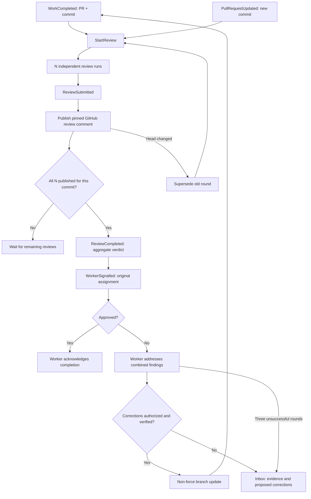
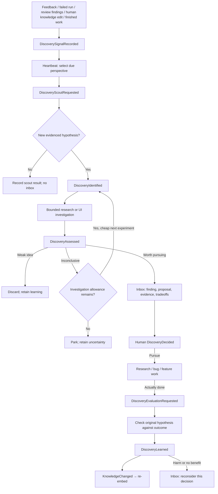
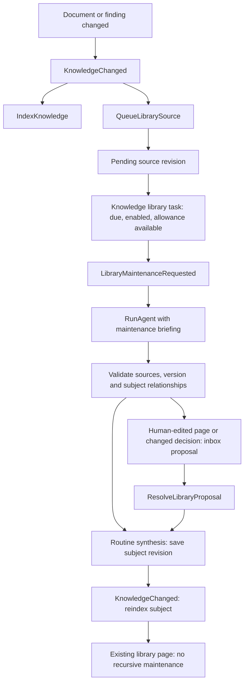

# Workflows

The executable trigger map is `src/domain/workflows.ts`. The runtime-validated event contracts are `src/domain/events.ts`; ports are in `src/application/ports.ts`.

## PR review and correction

1. In **Settings**, set 1–5 required reviews. Each round snapshots the configured count. A later policy edit applies to the next round.
2. In **Inbox → Background activity → Work in progress**, open a completed investigation and link its GitHub PR. `LinkPullRequest` verifies the current open PR and emits `WorkCompleted`. Agents do not invent a completion event or a PR URL from prose.
3. `StartReview` reads the current PR head and creates N distinct reviewer runs. Each sees the same pinned diff/source, PR description, assignment and company context, but not the other reviewers' findings.
4. `ReviewSubmitted` requests publication. A review only counts after the GitHub comment is published. Failure cannot count as approval. Same-account reviews use GitHub's COMMENT event; the Company OS approve/changes-requested verdict is in the body. These do **not** satisfy GitHub branch-protection approval requirements.
5. When every required review has published, `ReviewCompleted` contains the aggregate decision. Every reviewer must approve; there is no majority vote. `WorkerSignalled` resumes the original logical assignment with the original worker run ID/result plus combined findings. This is a new Codex invocation, not a resumed operating-system process or Codex session.
6. A correcting worker returns complete replacement files. With correction authority enabled, the adapter verifies source/test files in a fresh Sprite checkout, runs frozen install, type checking, `bun test`, build and Chrome browser tests, then publishes a non-force commit. Permitted paths are `src/`, `tests/`, `e2e/` TypeScript/TSX/CSS on `codex/` branches. Configuration, dependencies, workflows, secrets, merging and deployments are outside this correction adapter.
7. The changed head starts a new full round. A human or external push also triggers a new round through a one-minute PR-head poll. This polling interval is an edge adapter detail; workflow decisions still come from typed events.
8. After three unsuccessful rounds, or if corrections are not authorized/possible, the inbox contains the blocker and evidence. Proposed code is retained under the worker result. After changing authority or scope, **Resume corrections** starts a new worker invocation. A human cannot use **Mark done** to bypass review of the current linked commit.

New commits invalidate the round before review publication and before signalling the worker. Duplicate event delivery cannot add reviewer votes. A failed transport can recover a valid stored agent result only when the Codex event log confirms a completed turn. Stale results remain auditable. Review policy is separate from the daily heartbeat budget; each round has at most five reviewers and correction loops stop after three unsuccessful rounds. General work cancellation prevents queued reviews and corrections from proceeding; an already dispatched remote operation may finish.

The adapter rejects incomplete or oversized diffs instead of approving a partial review: up to 100 changed files, 320,000 characters of review evidence, and 100,000 characters per source file. Verification snapshots are bounded to 300 files and 5 MB. Large or binary-only changes require human review. Automatic correction verification also runs the Chrome integration suite, including the live DOM contract used by the browser inspection adapter. Chrome must be installed on the verification Sprite.

## Foreman and inbox

`ConversationStarted` / `ReplyReceived` → `RunAgent` → `RunCompleted` / `InputRequested`.

Each conversation has its own history. Contextual document discussions pin a document revision. Foreman requests open a subject-specific inbox thread with reason, recommendation and evidence. A reply resumes its linked assignment. Document proposals live in the corresponding inbox thread; acceptance emits `KnowledgeChanged` with the new version.

## Continuous discovery

Inbox contains developed recommendations and their Pursue action. **Automation** lists research tasks, with Schedule & limits, Pause/Resume and Run now on each task. Work and experiment history remain accessible there for auditing. The separate Overview and Feedback pages are removed; internal event signals still inform relevant tasks. Nine editable initial tasks cover direction, users/workflows, product possibilities, engineering health, correctness/operations, outside developments, business viability, organizational learning, and subtraction. The users/workflows task inspects the live interface before scouting by default.

The scheduler chooses an enabled, due task with available capacity. Each task owns its cadence, daily run allowance (UTC), active idea limit, open-work limit and investigation count. All automatic research and follow-up runs charge that task. A run queued on an earlier UTC day reserves capacity again on the day it starts. New signals may bring a task forward after a 15-minute cooldown; overdue tasks get priority to avoid starvation. There are no reserved exploration slots or shared exploration budget. Run now bypasses cadence and permits one scout while a task is paused, without enabling its schedule; follow-up automated work remains paused. Budgets and constitution requirements still apply. Paused queued tasks do not block other tasks. A running invocation may finish after a pause. The UI shows blockers instead of labelling an obsolete timestamp as the next run; future eligibility uses the viewer's timezone.

Older persisted discovery settings migrate once into each task's settings, preserving an existing global pause as paused tasks and copying the prior limits. Legacy non-task work remains compatible with its old controls; those settings do not gate these task schedules. Earlier run and event records remain intact.

Scouts can create at most two hypotheses per result and cannot create direct work or inbox requests. Each hypothesis records the observation, expected impact, uncertainty, evidence, and a cheap falsifiable experiment. The default active-idea limit is six. Exact normalized titles and strongly overlapping hypotheses are deduplicated against all prior ideas, including discarded ideas. This is a deterministic heuristic, not semantic proof of novelty.

An investigation produces a structured recommend/discard/inconclusive assessment. Recommendations require a concrete proposed work item and open an inbox thread. Inconclusive work can request another bounded experiment, up to two investigations per idea by default; then it parks. Human **Revisit** requires a reason and explicitly authorizes an additional investigation, retaining the history. **Pursue** queues the proposed work. **Park** and **Discard** cancel unfinished investigations and retain the decision. There is no model-controlled increase to budget, authority, perspectives or investigation limits.

When pursued work becomes done, an outcome check compares the result with the original hypothesis. Improved, no benefit, harmful and inconclusive are separate outcomes. A finished task alone does not demonstrate deployment or user benefit. Negative outcomes push back through the inbox. Assessments, human decisions and outcomes revise an attributed Knowledge entry and trigger re-embedding; unverified conclusions remain hypotheses. Existing accepted product/architecture documents are not rewritten automatically.

Context includes the selected perspective, triggering signals, prior ideas, current hypothesis, prior investigation/delivery results, and ordinary repository/document/browser evidence. Historical runs retain their exact supplied context. Each perspective can additionally read the newest public GitHub releases from up to three human-configured `owner/repo` sources; the outside perspective initially follows `oven-sh/bun`. This adapter uses bounded, credential-free requests to a fixed GitHub API origin, rejects redirects and exposes source errors. Release notes are attributed claims. General web search, analytics and customer-feedback integrations are not connected. Manual signals can supply feedback and source excerpts; pasted links are retained but are not automatically fetched.

Research and bounded Chrome inspection run autonomously. General code implementation, PR creation, merging and deployment remain outside this executor. Implementation handoffs return `needs_execution`; outcome checks begin only after work actually reaches done. Agent claims still require human auditing: capability instructions and evidence references are not formal verification of semantic truth.

Signals coalesce pending repeats and retain the newest 200 entries. Scout contexts preserve consumed evidence; discovery-generated learning does not trigger another discovery loop. Delivery replay is guarded by event IDs (the last 2,000 observed signal events) and current lifecycle state. Ideas, decisions, run results and document revisions retain their full history.

## Knowledge

`KnowledgeChanged(documentId, version)` → `IndexKnowledge` → `KnowledgeIndexed(documentId, version)`.

Every human edit or accepted proposal creates a revision. Old vectors disappear immediately. Indexing a superseded version does nothing. The document view explains eligibility; Knowledge exposes source, chunks, versions and actual run usage. Context preview explains inclusion and exclusion; historical run contexts show exactly what was supplied.

## Library maintenance

Maintenance is a separate task in Automation, with Pause/Resume, interval, runs per day and Run now. It only runs with pending source material and a constitution. A successful pass marks only the exact supplied source revisions as processed; newer edits remain queued. Failed passes retain evidence for retry, and incomplete briefings reach the inbox. Processing is bounded to three sources and four page changes per pass. Ordinary agents contribute observations; only the maintenance workflow can apply library updates. Governing-document proposals retain their existing human approval workflow.

## Conversation context

Before each run, the application retrieves eligible subjects using the assignment and conversation intent, expands parent/related guidance, and renders the constitution → knowledge → conversation → assignment briefing. The model can identify a missing subject in `contextRequests`; the application makes one additional retrieval pass and stores the expanded snapshot before a second invocation. Unresolved requests stop proposed actions and are reported explicitly. Review invocations cannot approve a PR with an unresolved context request. Inbox Context used displays the exact supplied pages, revisions, selection reasons, excerpts, summary and assignment. Previous replies retain their own context even after a page is edited and re-embedded.
