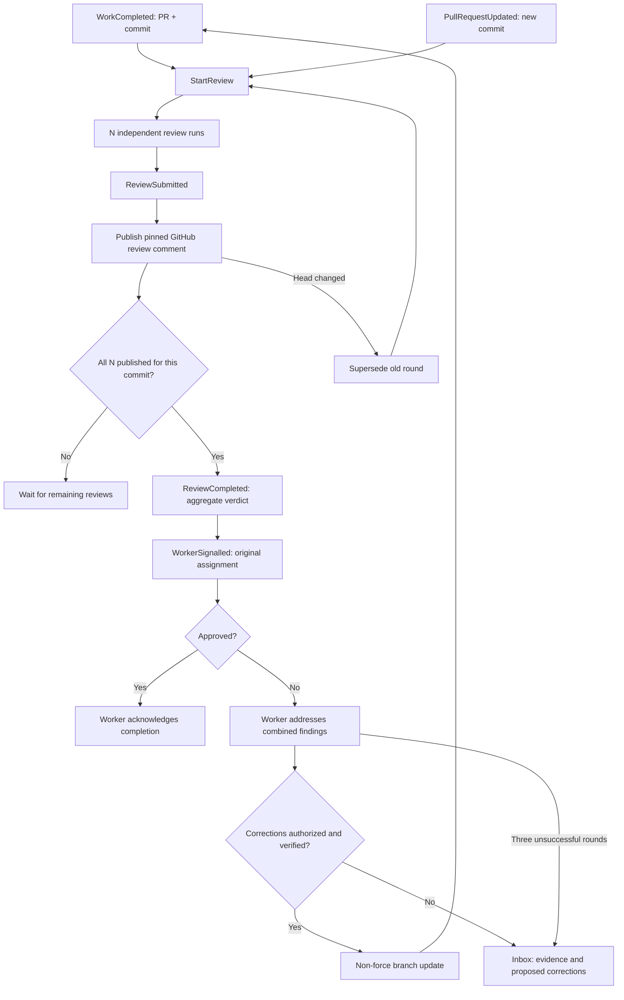

# Workflows

The executable trigger map is `src/domain/workflows.ts`. The runtime-validated event contracts are `src/domain/events.ts`; ports are in `src/application/ports.ts`.

## PR review and correction

1. In **Settings**, set 1–5 required reviews. Each round snapshots the configured count. A later policy edit applies to the next round.
2. In **Work**, open a completed investigation and link its GitHub PR. `LinkPullRequest` verifies the current open PR and emits `WorkCompleted`. Agents do not invent a completion event or a PR URL from prose.
3. `StartReview` reads the current PR head and creates N distinct reviewer runs. Each sees the same pinned diff/source, assignment and company context, but not the other reviewers' findings.
4. `ReviewSubmitted` requests publication. A review only counts after the GitHub comment is published. Failure cannot count as approval. Same-account reviews use GitHub's COMMENT event; the Company OS approve/changes-requested verdict is in the body. These do **not** satisfy GitHub branch-protection approval requirements.
5. When every required review has published, `ReviewCompleted` contains the aggregate decision. Every reviewer must approve; there is no majority vote. `WorkerSignalled` resumes the original logical assignment with the original worker run ID/result plus combined findings. This is a new Codex invocation, not a resumed operating-system process or Codex session.
6. A correcting worker returns complete replacement files. With correction authority enabled, the adapter verifies source/test files in a fresh Sprite checkout, runs frozen install, type checking, `bun test` and build, then publishes a non-force commit. Permitted paths are `src/`, `tests/`, `e2e/` TypeScript/TSX/CSS on `codex/` branches. Configuration, dependencies, workflows, secrets, merging and deployments are outside this correction adapter.
7. The changed head starts a new full round. A human or external push also triggers a new round through a one-minute PR-head poll. This polling interval is an edge adapter detail; workflow decisions still come from typed events.
8. After three unsuccessful rounds, or if corrections are not authorized/possible, the inbox contains the blocker and evidence. Proposed code is retained under the worker result. After changing authority or scope, **Resume corrections** starts a new worker invocation. A human cannot use **Mark done** to bypass review of the current linked commit.

New commits invalidate the round before review publication and before signalling the worker. Duplicate event delivery cannot add reviewer votes. Stale results remain auditable. Review policy is separate from the daily heartbeat budget; each round has at most five reviewers and correction loops stop after three unsuccessful rounds. General work cancellation prevents queued reviews and corrections from proceeding; an already dispatched remote operation may finish.

The adapter rejects incomplete or oversized diffs instead of approving a partial review: up to 100 changed files, 240,000 characters of review evidence, and 100,000 characters per source file. Verification snapshots are bounded to 300 files and 5 MB. Large or binary-only changes require human review. Browser integration tests are a separate check; automatic correction verification currently runs unit tests and the build, not browser tests.

## Foreman and inbox

`ConversationStarted` / `ReplyReceived` → `RunAgent` → `RunCompleted` / `InputRequested`.

Each conversation has its own history. Contextual document discussions pin a document revision. Foreman requests open a subject-specific inbox thread with reason, recommendation and evidence. A reply resumes its linked assignment. Document proposals live in the corresponding inbox thread; acceptance emits `KnowledgeChanged` with the new version.

## Heartbeat and work

`HeartbeatDue` → `RunAgent` → `WorkCreated` → `ScheduleWork` → `RunRequested` → `RunAgent`.

Heartbeats assess an objective and the existing work/inbox. The application enforces enable/pause, interval, daily run budget, open-work limit and title deduplication. At most two new work suggestions are accepted from one result. The queue persists across restarts. Research and browser inspection return evidence, findings, proposals or focused questions. An agent cannot mark unperformed engineering implementation as completed by claiming it in prose; the executor's capability is explicitly included in its instructions, and implementation is handed off as `needs_execution`.

The last sentence is an instruction constraint, not a formal proof of an agent's claim. Human auditing and evidence review remain necessary.

## Knowledge

`KnowledgeChanged(documentId, version)` → `IndexKnowledge` → `KnowledgeIndexed(documentId, version)`.

Every human edit or accepted proposal creates a revision. Old vectors disappear immediately. Indexing a superseded version does nothing. The document view explains eligibility; Understanding exposes source, chunks, versions and actual run usage. Context preview explains inclusion and exclusion; historical run contexts show exactly what was supplied.
